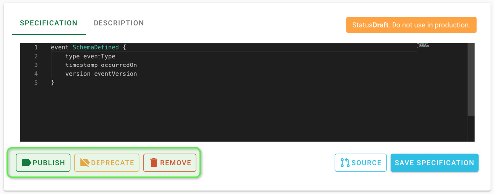
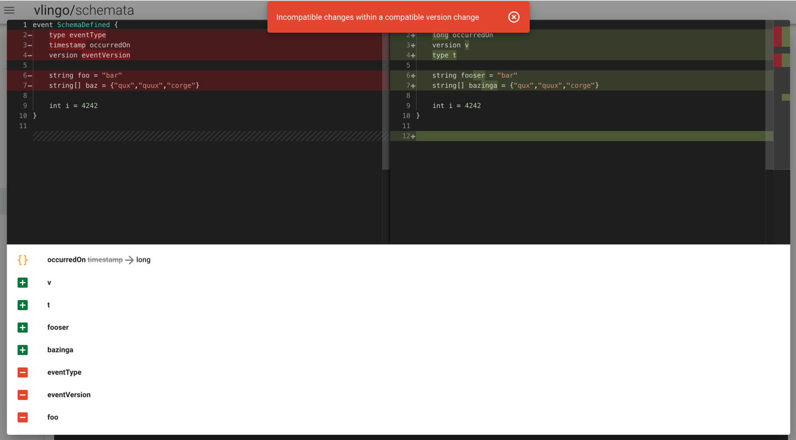

= Integration With VLINGO XOOM SCHEMATA

ifdef::env-github[]
:tip-caption: :bulb:
:note-caption: :information_source:
:important-caption: :heavy_exclamation_mark:
:caution-caption: :fire:
:warning-caption: :warning:
endif::[]

XOOM SCHEMATA enables the management of schemas for events and commands that are
to be consumed by other services and applications (e.g. Bounded Contexts), thus
implementing the Published Language pattern.

XOOM SCHEMATA can be run as a standalone service with a user interface
and by means of an HTTP API providing schema management from builds or
command line interaction. The build interfaces requires the use of `vlingo-build-plugins`.
With SCHEMATA you can push schemas to and pull schemas from the registry, and generate
source code for the schemas.

In projects you'll typically consume and/or publish schemas to integrate
with other services and applications (e.g. Bounded Contexts) in a type safe
and versioned manner.

In this example, you'll see how to:

* build and run `vlingo/schemata`
* manage schemata and schema meta data using the UI and the HTTP API
* push schemata to the registry from maven builds
* consume schemata stored in the registry as part of maven builds

For detailed information on the rationale and usage of XOOM SCHEMATA,
refer to the documentation (https://docs.vlingo.io/vlingo-schemata)[SCHEMATA]
and the (https://docs.vlingo.io/vlingo-build-plugins)[build plugins].

== Prerequisites

To be able to follow along, you'll need:

* JDK 8
* Maven 3.3.x
* A running instance of XOOM SCHEMATA (see <<Setting Up XOOM SCHEMATA>>)
* Some master data (see <<Provision Schemata Master Data>>)

=== Setting Up XOOM SCHEMATA

The easiest way to get started is to use the (https://hub.docker.com/r/vlingo/vlingo-schemata)[`vlingo/vlingo-schemata` docker image]:

```
$ docker run -eVLINGO_ENV=dev -p9019:9019 vlingo/vlingo-schemata
```

This will expose the application on `:9019` using an in-memory database for persistence.

If you want to build SCHEMATA yourself:

```
$ clone https://github.com/vlingo/vlingo-schemata
```

Refer to (https://github.com/vlingo/vlingo-schemata#build)[Build] for further instructions.
footnote:[`mvn package -Pfrontend` on JDK8 does the trick. Thats about it, instruction-wise, actually.]

NOTE: For further configuration options like connecting to a persistent database,
see (https://hub.docker.com/r/vlingo/vlingo-schemata)[`vlingo/vlingo-schemata` on Docker Hub].

=== Provision Schemata Master Data

To integrate your projects with the schema registry, you need to
make your organization structure and available published languages known first.
You can do this either via the HTTP API or the UI.

Schemas are structured in a hierarchical manner:
`Organisation -> Units -> Contexts -> Schemas -> Schema Versions`.
We'll push new schema versions using the maven plugin.
Before running the build, you need to have at least one of each other entity prepared.

==== Using the UI

From the navigation drawer to the left, open the editor for each of these entities and create one.
The build assumes the following structure:

* Organisation: `VLINGO`
** Unit: `examples`
***** Context Namepace: `io.vlingo.examples.schemata`
****** Schema: `SchemaDefined`
****** Schema: `SchemaPublished`

.Create context using the UI
image::doc/ui-context.png[]

.The result should look like this
image::doc/ui-browse.png[]

==== Using the API

In case you are using IntelliJ, you can just run the requests in `masterdata.http` directly;
`masterdata.sh` is a bash script doing the same
footnote:[Requires `curl` and `jq` on the path and `VLINGO_SCHEMATA_PORT` to be set, e.g. `VLINGO_SCHEMATA_PORT=9019 ./masterdata.sh`].
Otherwise, deriving the `wget` footnote:[Use `Postman`, `HTTPie`, `Insomnia`, or `Invoke-WebRequest`. It's your choice.]
calls from the snippets should be a simple exercise.

== Run

Now that there is master data in place, we can publish some schemas from
`vlingo-schemata-producer`. The schema sources are within the project, inside
`src/main/vlingo/schemata`. To publish the schemas to the registry,
simply run `mvn install` in the project root.
The build output should contain <<output-producer>>, the UI should display the created schemas as shown in <<ui-schema-version>>.
You can also have a look at the generated code (`Specification -> Source`) and the generated description (`Description -> Preview`)


Next, hop over to `vlingo-schemata-consumer` and open `SchemataUsageTest` in your IDE.
You'll notice that it does not compile, as the schema class is missing.
Now run `mvn generate-sources` and verify that the code generated from schemata is
pulled and written to `target/generated-sources/vlingo` as shown in <<output-consumer>>.
The tests that depend on schema sources will now compile and execute as expected.
Verify this by running `mvn test`.

NOTE: This is just for illustration purposes. Typically, you'll rely on maven's default lifecycle binding
 and not call `generate-sources` explicitly. Simply running `mvn install` will determine
 that `vlingo-build-plugin` is bound to `generate-sources` and run it before compilation.

In the build output you will see two warning messages indicating that the status of the schema
used is `Draft`. You can go through the schema's lifecycle using the UI as highlighted in <<ui-schema-version-lifecycle>>.
Alternatively, you can change the status using the API by `PATCHing` against:

```
http://localhost:9019/api/organizations/<orgId>/units/<unitId>/contexts/<contextId>/schemas/<schemaId>/versions/<schemaVersionId>/status
```

Now, publish one of the schemas and re-run the consumer build. You'll notice the warning was eliminated.
Now deprecate the schema, and re-build again. You'll see a warning again.
After setting the state to removed, your consumer build will fail, see <<output-consumer-removed-schema>>. Try that as well.

XOOM SCHEMATA also provides a safety net to prevent you from publishing incompatible versions by
accident, so you won't break consumers of your published versions.
To see what happens in this case, open the `SchemaDefined.vss` specification and make some incompatible changes,
e.g. by changing a type, reordering some fields and changing field names:

.incompatible update to SchemaDefined see src/main/vlingo/schemata/SchemaDefined2
```
event SchemaDefined {
    long occurredOn
    version v
    type t
}
```

In the producer project's `pom.xml`, remove the second schema from the list of
schemas to push and reference the updated file as a new patch version.

.refer to the updated schema in the POM
```
<schema>
  <ref>VLINGO:examples:io.vlingo.examples.schemata:SchemaDefined:0.0.2</ref> <1>
  <src>SchemaDefined2.vss</src> <2>
  <previousVersion>0.0.1</previousVersion> <3>
</schema>
```
<1> updated reference to new version
<2> use updated specification; this would normally be the same file
<3> specify which version the update is applied to

You'll notice that the build fails and presents you with a list of changes you have made.
Now you can either change the update to make it compatible or update the version to the next
major version `1.0.0`.

By using the schema registry you not only have a way to integrate multiple bounded contexts,
but are, as a consumer, safe from inadvertent upstream incompatibilities and, as a publisher,
safe from accidentally pushing such updates.

If you've tried this via the UI, you would have seen a detailed <<ui-incompatible-diff>> as shown below.

[[output-producer]]
.producer build output
[source]
---
[INFO] --- vlingo-build-plugins:0.9.3-RC4:push-schemata (default) @ vlingo-schemata-producer ---
[INFO] vlingo/maven: Pushing project schemata to vlingo-schemata registry.
[INFO] Pushing Vlingo:examples:io.vlingo.examples.schemata:SchemaDefined:0.0.1 to http://localhost:9019/versions/Vlingo:examples:io.vlingo.examples.schemata:SchemaDefined:0.0.1.
[INFO] Successfully pushed http://localhost:9019/versions/Vlingo:examples:io.vlingo.examples.schemata:SchemaDefined:0.0.1
[INFO] Setting source to SchemaPublished.vss for Vlingo:examples:io.vlingo.examples.schemata:SchemaPublished:0.0.1
[INFO] Pushing Vlingo:examples:io.vlingo.examples.schemata:SchemaPublished:0.0.1 to http://localhost:9019/versions/Vlingo:examples:io.vlingo.examples.schemata:SchemaPublished:0.0.1.
[INFO] Successfully pushed http://localhost:9019/versions/Vlingo:examples:io.vlingo.examples.schemata:SchemaPublished:0.0.1
---

[[ui-schema-version]]
.schema version in the UI
image::doc/ui-schema-version.png[]

[[output-consumer]]
.consumer build output
[source]
---
[INFO] --- vlingo-build-plugins:1.0.0:pull-schemata (pullSchemata) @ vlingo-schemata-consumer ---
[INFO] vlingo/maven: Pulling code generated from vlingo/schemata registry.
[INFO] SchemataService{url=http://localhost:9019, clientOrganization='Vlingo', clientUnit='examples'}
[INFO] Retrieving version data for Vlingo:examples:io.vlingo.examples.schemata:SchemaDefined:0.0.1 from http://localhost:9019/versions/Vlingo:examples:io.vlingo.examples.schemata:SchemaDefined:0.0.1/status
[WARNING] Vlingo:examples:io.vlingo.examples.schemata:SchemaDefined:0.0.1 status is 'Draft': don't use in production builds
[INFO] Pulling Vlingo:examples:io.vlingo.examples.schemata:SchemaDefined:0.0.1 from http://localhost:9019/code/Vlingo:examples:io.vlingo.examples.schemata:SchemaDefined:0.0.1/java
[INFO] Pulled Vlingo:examples:io.vlingo.examples.schemata:SchemaDefined:0.0.1
[INFO] Writing Vlingo:examples:io.vlingo.examples.schemata:SchemaDefined:0.0.1 to /private/tmp/vlingo-examples/vlingo-schemata-integration/vlingo-schemata-consumer/target/generated-sources/vlingo/io/vlingo/examples/schemata/event/SchemaDefined.java
[INFO] Wrote /private/tmp/vlingo-examples/vlingo-schemata-integration/vlingo-schemata-consumer/target/generated-sources/vlingo/io/vlingo/examples/schemata/event/SchemaDefined.java
[INFO] Retrieving version data for Vlingo:examples:io.vlingo.examples.schemata:SchemaPublished:0.0.1 from http://localhost:9019/versions/Vlingo:examples:io.vlingo.examples.schemata:SchemaPublished:0.0.1/status
[WARNING] Vlingo:examples:io.vlingo.examples.schemata:SchemaPublished:0.0.1 status is 'Draft': don't use in production builds
[INFO] Pulling Vlingo:examples:io.vlingo.examples.schemata:SchemaPublished:0.0.1 from http://localhost:9019/code/Vlingo:examples:io.vlingo.examples.schemata:SchemaPublished:0.0.1/java
[INFO] Pulled Vlingo:examples:io.vlingo.examples.schemata:SchemaPublished:0.0.1
[INFO] Writing Vlingo:examples:io.vlingo.examples.schemata:SchemaPublished:0.0.1 to /private/tmp/vlingo-examples/vlingo-schemata-integration/vlingo-schemata-consumer/target/generated-sources/vlingo/io/vlingo/examples/schemata/event/SchemaPublished.java
[INFO] Wrote /private/tmp/vlingo-examples/vlingo-schemata-integration/vlingo-schemata-consumer/target/generated-sources/vlingo/io/vlingo/examples/schemata/event/SchemaPublished.java
---

[[ui-schema-version-lifecycle]]
.schema version lifecycle


[[output-consumer-removed-schema]]
.consumer using a removed schema version
[source]
---
[INFO] --- vlingo-build-plugins:1.0.0:pull-schemata (pullSchemata) @ vlingo-schemata-consumer ---
[INFO] vlingo/maven: Pulling code generated from vlingo/schemata registry.
[INFO] SchemataService{url=http://localhost:9019, clientOrganization='Vlingo', clientUnit='examples'}
[INFO] Retrieving version data for Vlingo:examples:io.vlingo.examples.schemata:SchemaDefined:0.0.1 from http://localhost:9019/versions/Vlingo:examples:io.vlingo.examples.schemata:SchemaDefined:0.0.1/status
[ERROR] Vlingo:examples:io.vlingo.examples.schemata:SchemaDefined:0.0.1 status is 'Removed' and may no longer be used
[INFO] ------------------------------------------------------------------------
[INFO] BUILD FAILURE
[INFO] ------------------------------------------------------------------------
[INFO] Total time:  0.773 s
[INFO] Finished at: 2020-01-17T09:54:30+01:00
[INFO] ------------------------------------------------------------------------
[ERROR] Failed to execute goal io.vlingo:vlingo-build-plugins:1.0.0:pull-schemata (pullSchemata) on project vlingo-schemata-consumer: Vlingo:examples:io.vlingo.examples.schemata:SchemaDefined:0.0.1 has reached the end of its life cycle -> [Help 1]
---

[[ui-incompatible-diff]]
.incompatible diff

