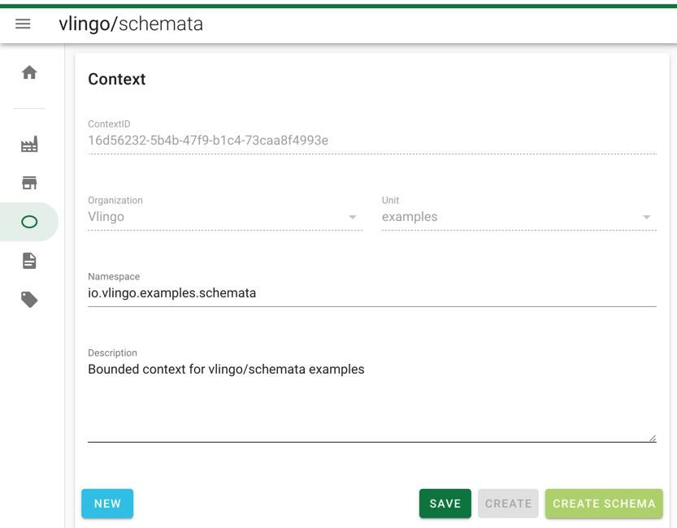
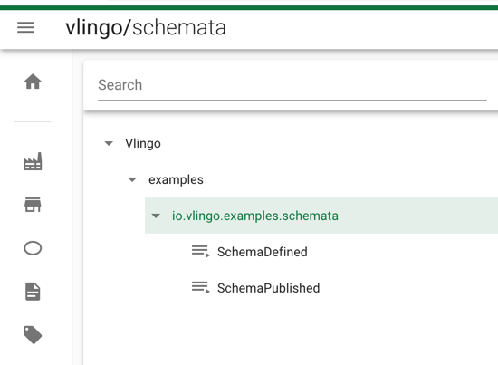
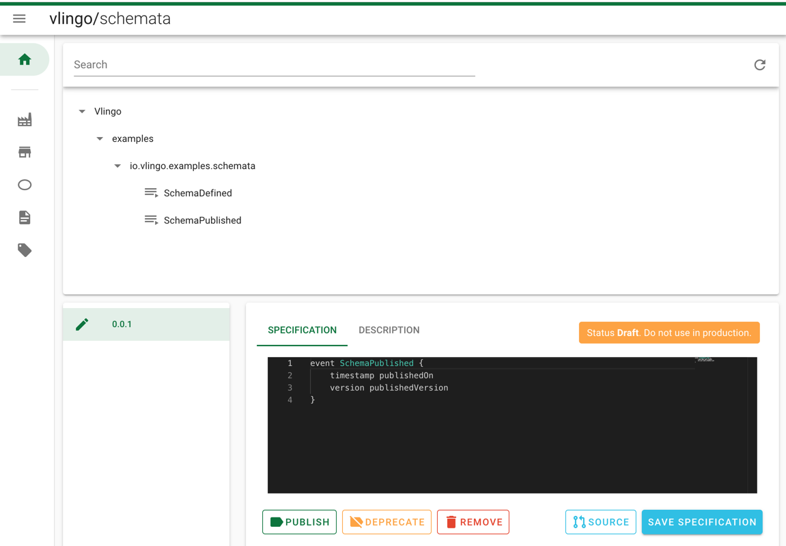

= Integration w/ vlingo/schemata

ifdef::env-github[]
:tip-caption: :bulb:
:note-caption: :information_source:
:important-caption: :heavy_exclamation_mark:
:caution-caption: :fire:
:warning-caption: :warning:
endif::[]

`vlingo/schemata` allows for managing schemata for events and commands that
to be consumed by other bounded contexts, thus implementing the published language pattern.

`vlingo/schemata` can be run as standalone service and comes with a user interface
and an HTTP API that lets you manage master data and schemata. Using `vlingo-build-plugins`,
you can also interact with schemata as part of your build process.

In projects, you'll typically consume and/or publish schemata to be able to integrate
with other bounded contexts in a type safe and versioned manner.

In this example, you'll see how to ...

* ... build an run `vlingo/schemata`
* ... manage schemata and schemata meta data using the UI and the HTTP API.
* ... push schemata to the registry from maven builds and
* ... consume schemata stored in the registry as part of the build.


NOTE: This is the first iteration of the example. We're already working on updates showing
version validation and the schemata lifecycle.

== Prerequisites

To be able to follow along, you'll need:

* JDK 8
* Maven 3.3.x
* A running instance of `vlingo/schemata` (see <<Set up vlingo/schemata>>)
* Some master data (see <<Provision schemata master data>>)

=== Set up vlingo/schemata

* Clone https://github.com/vlingo/vlingo-schemata
* Make sure your JDK is set to a 1.8 version in the shell you're building in footnote:[If you're juggling JDKs, https://sdkman.io/ might help you.]
* Run `mvn package -Pfrontend` in the project root
* Run `VLINGO_SCHEMATA_PORT=9019 java -jar target/vlingo-schemata-<version>-jar-with-dependencies.jar env`.
This starts a schemata instance listening on port 9019 running on an embedded in memory database.
* Open http://localhost:9019/. If you see something with `vlingo/schemata` in the the title bar, you're good to go.

NOTE: To run against a persistent database, please have a look at https://github.com/vlingo/vlingo-schemata/

TIP: We'll provide a working docker image soon, please bear with us and build schemata yourself in the meantime.

=== Provision schemata master data

To be able to integrate your projects with the schema registry, you need to
make your organization structure and available published languages known first.
You can do this either via the HTTP API or the UI.

Schemata are structured in a hierarchical manner:
`Organisation -> Units -> Contexts -> Schemas -> Schema Versions`.
We'll push new schema versions using the maven plugin.
Before running the build, you need to have at least one of each other entity prepared.

==== Using the UI

From the navigation drawer to the left, open the editor for each of these entities and create one.
The build assumes the following structure:

* Organisation: `Vlingo`
** Unit: `examples`
***** Context Namepace: `io.vlingo.examples.schemata`
****** Schema: `SchemaDefined`
****** Schema: `SchemaPublished`

.Create context using the UI


.The result should look like this


==== Using the API

In case you are using IntelliJ, you can just run the requests in `masterdata.http` directly;
`masterdata.sh` is a bash script doing the same footnote:[Requires `curl` and `jq` on the path and `VLINGO_SCHEMATA_PORT` to be set].
Otherwise, deriving the `wget` footnote:[`PostMan`, `HTTPie`, `Insomnia`, `Invoke-WebRequest` pick your flavor.]
calls from the snippets should be a simple exercise.

== Run

Now that we have the master data in place, we can publish some schemata from
`vlingo-schemata-producer`. The schema sources live in `src/main/vlingo/schemata`
in that project. To publish them, simply run `mvn install` in the project root.
The build output should contain <<output-producer>>, the <<ui-schema-version>> should look like
the screenshot below. You can also have a look at the generated code (`Specification -> Source`) and description using the
and the generated description (`Description -> Preview`)


Next, hop over to `vlingo-schemata-consumer` and open `SchemataUsageTest` in your IDE.
You'll notice that it does not compile, as the schema class is missing.
Now run `mvn generate-sources` and verify that the code generated from schemata is
pulled and written to `target/generated-sources/vlingo` as shown in <<output-consumer>>.
The test relying on schemata sources will now compile and execute as expected.

NOTE: This is just for illustration purposes. Typically, you'll rely on maven's default lifecycle binding
 and not call `generate-sources` explicitly. Simply running `mvn install` will determine
 that `vlingo-build-plugin` is bound to `generate-sources` and run it before.

`vlingo/schemata` also provides a safety net to prevent you from publishing incompatible versions by
accident, so you won't break consumers of your published versions.
To emulate this, open the `SchemaDefined.vss` specification and make some incompatible changes, e.g. by changing
a type, reordering some fields and changing field names:

.incompatible update to `SchemaDefined` see `src/main/vlingo/schemata/SchemaDefined`
```
event SchemaDefined {
    long occurredOn
    version v
    type t
}
```

In the producer project's pom, reference the updated file as a new patch version:
```
<schema>
  <ref>Vlingo:examples:io.vlingo.examples.schemata:SchemaDefined:0.0.2</ref> <1>
  <src>SchemaDefined2.vss</src> <2>
  <previousVersion>0.0.1</previousVersion> <3>
</schema>
```
<1> updated reference to new version
<2> use updated specification; this would normally be the same file
<3> specify the version the update is applied to


[[output-producer]]
.producer build output
[source]
---
[INFO] --- vlingo-build-plugins:0.9.3-RC4:push-schemata (default) @ vlingo-schemata-producer ---
[INFO] vlingo/maven: Pushing project schemata to vlingo-schemata registry.
[INFO] Pushing Vlingo:examples:io.vlingo.examples.schemata:SchemaDefined:0.0.1 to http://localhost:9019/versions/Vlingo:examples:io.vlingo.examples.schemata:SchemaDefined:0.0.1.
[INFO] Successfully pushed http://localhost:9019/versions/Vlingo:examples:io.vlingo.examples.schemata:SchemaDefined:0.0.1
[INFO] Setting source to SchemaPublished.vss for Vlingo:examples:io.vlingo.examples.schemata:SchemaPublished:0.0.1
[INFO] Pushing Vlingo:examples:io.vlingo.examples.schemata:SchemaPublished:0.0.1 to http://localhost:9019/versions/Vlingo:examples:io.vlingo.examples.schemata:SchemaPublished:0.0.1.
[INFO] Successfully pushed http://localhost:9019/versions/Vlingo:examples:io.vlingo.examples.schemata:SchemaPublished:0.0.1
---

[[ui-schema-version]]
.schema version in the UI


[[output-consumer]]
.consumer build output
[source]
---
[INFO] --- vlingo-build-plugins:0.9.3-RC4:pull-schemata (pullSchemata) @ vlingo-schemata-consumer ---
[INFO] vlingo/maven: Pulling code generated from vlingo/schemata registry.
[INFO] SchemataService{url=http://localhost:9019, clientOrganization='Vlingo', clientUnit='examples'}
[INFO] Pulling Vlingo:examples:io.vlingo.examples.schemata:SchemaDefined:0.0.1 from http://localhost:9019/code/Vlingo:examples:io.vlingo.examples.schemata:SchemaDefined:0.0.1/java
[INFO] Pulled Vlingo:examples:io.vlingo.examples.schemata:SchemaDefined:0.0.1
[INFO] Writing Vlingo:examples:io.vlingo.examples.schemata:SchemaDefined:0.0.1 to /Users/wwerner/Projects/vlingo/vlingo-examples/vlingo-schemata-integration/vlingo-schemata-consumer/target/classes/generated-sources/vlingo/io/vlingo/examples/schemata/event/SchemaDefined.java
[INFO] Wrote /Users/wwerner/Projects/vlingo/vlingo-examples/vlingo-schemata-integration/vlingo-schemata-consumer/target/classes/generated-sources/vlingo/io/vlingo/examples/schemata/event/SchemaDefined.java
[INFO] Pulling Vlingo:examples:io.vlingo.examples.schemata:SchemaPublished:0.0.1 from http://localhost:9019/code/Vlingo:examples:io.vlingo.examples.schemata:SchemaPublished:0.0.1/java
[INFO] Pulled Vlingo:examples:io.vlingo.examples.schemata:SchemaPublished:0.0.1
[INFO] Writing Vlingo:examples:io.vlingo.examples.schemata:SchemaPublished:0.0.1 to /Users/wwerner/Projects/vlingo/vlingo-examples/vlingo-schemata-integration/vlingo-schemata-consumer/target/classes/generated-sources/vlingo/io/vlingo/examples/schemata/event/SchemaPublished.java
[INFO] Wrote /Users/wwerner/Projects/vlingo/vlingo-examples/vlingo-schemata-integration/vlingo-schemata-consumer/target/classes/generated-sources/vlingo/io/vlingo/examples/schemata/event/SchemaPublished.java
---
